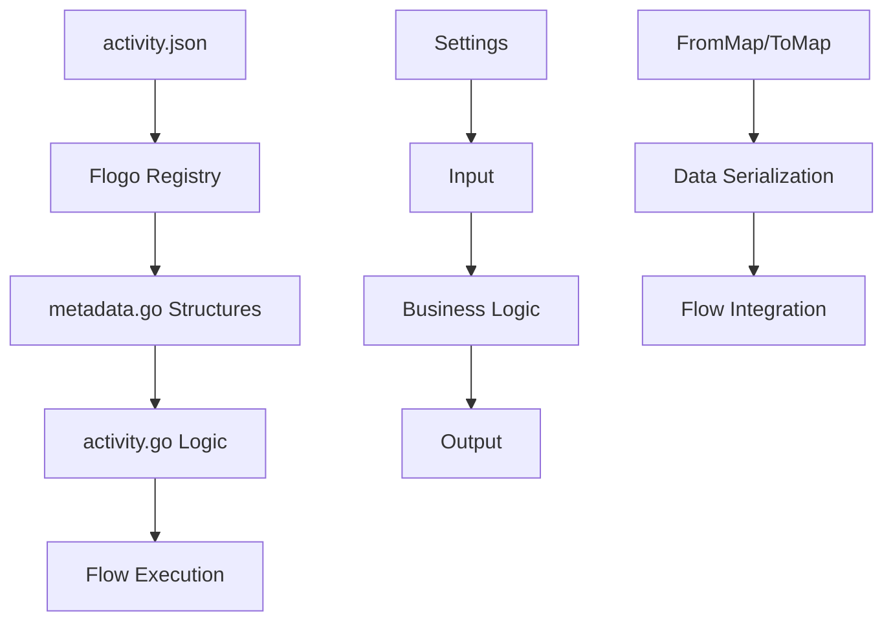

# Flogo Custom Activity Development Guide

## Overview

This guide demonstrates how to create custom Flogo activities in Go, based on real-world examples from the OpenAI extension activities (`uploadFile`, `listVectorStoreFiles`, and `vectorSearch`). A Flogo activity is a reusable component that performs a specific operation within a Flogo flow, such as API calls, data transformation, or business logic execution.

## Table of Contents

1. [Activity Structure Overview](#activity-structure-overview)
2. [Getting Started: Creating Activity Skeleton](#getting-started-creating-activity-skeleton)
3. [Core Components Deep Dive](#core-components-deep-dive)
4. [Best Practices and Patterns](#best-practices-and-patterns)
5. [Testing and Validation](#testing-and-validation)
6. [Advanced Topics](#advanced-topics)

## Activity Structure Overview

Every Flogo activity follows a standardized structure with these essential components:

```
myActivity/
├── activity.json         # Activity metadata and configuration
├── metadata.go          # Data structures and serialization
├── activity.go          # Core business logic
├── activity_test.go     # Unit tests
├── icons/              # UI icons
│   ├── smallIcon.png
│   └── largeIcon.png
├── sample/             # Example flows
│   └── example.flogo
└── README.md           # Documentation
```

### Core Components Interaction Flow



```
myActivity/
├── activity.json         # Activity metadata and configuration
├── metadata.go          # Data structures and serialization
├── activity.go          # Core business logic
├── activity_test.go     # Unit tests
├── icons/              # UI icons
│   ├── smallIcon.png
│   └── largeIcon.png
├── sample/             # Example flows
│   └── example.flogo
└── README.md           # Documentation
```

### Core Components Interaction Flow


## Getting Started: Creating Activity Skeleton

### Step 1: Create Directory Structure

#### Purpose
Establish the standardized file organization that Flogo requires for activity discovery, registration, and runtime execution. This structure ensures your activity integrates seamlessly with the Flogo ecosystem and follows established conventions.

#### Dependencies
- Write access to the target directory
- Basic understanding of Go module structure
- No external tools required (uses standard shell commands)

#### Implementation
```bash
mkdir -p extensions/myExtension/src/activity/myActivity/{icons,sample}
cd extensions/myExtension/src/activity/myActivity
```

**Directory Structure Explained:**
- `extensions/`: Root for all custom extensions
- `myExtension/`: Your extension namespace (e.g., `openAI`, `database`)
- `src/activity/`: Flogo's expected path for activity source code
- `myActivity/`: Your specific activity name (e.g., `uploadFile`, `vectorSearch`)
- `icons/`: UI assets for Flogo Studio/Web UI integration
- `sample/`: Example flows demonstrating activity usage

### Step 2: Initialize Activity Metadata (activity.json)

#### Purpose
Define the activity's contract and metadata for the Flogo runtime and development tools. This file serves as the single source of truth for:
- Activity registration and discovery
- UI form generation in Flogo Studio/Web UI
- Input/output schema validation
- Configuration option definitions
- Version management and compatibility

#### Dependencies
- Step 1 completed (directory structure exists)
- Understanding of JSON schema structure
- Knowledge of your activity's intended functionality
- No external libraries required

#### Implementation
The `activity.json` file defines the activity's metadata, configuration options, and UI integration.

```json
{
  "name": "my-custom-activity",
  "version": "1.0.0",
  "type": "flogo:activity",
  "title": "My Custom Activity",
  "author": "Your Organization",
  "ref": "github.com/yourorg/flogo-extension/activity/myActivity",
  "display": {
    "category": "Custom",
    "visible": true,
    "description": "Description of what this activity does",
    "smallIcon": "icons/smallIcon.png",
    "largeIcon": "icons/largeIcon.png"
  },
  "feature": {
    "retry": {
      "enabled": true
    }
  },
  "settings": [
    {
      "name": "apiEndpoint",
      "type": "string",
      "required": true,
      "display": {
        "name": "API Endpoint",
        "description": "The API endpoint URL",
        "appPropertySupport": true
      }
    }
  ],
  "inputs": [
    {
      "name": "inputData",
      "type": "string",
      "required": true,
      "display": {
        "name": "Input Data",
        "description": "Data to process"
      }
    }
  ],
  "outputs": [
    {
      "name": "result",
      "type": "object",
      "display": {
        "name": "Result",
        "description": "Processing result"
      }
    }
  ]
}
```

### Step 3: Create Basic Go Package Structure (metadata.go)

#### Purpose
Implement the Go data structures and serialization logic that bridge between Flogo's runtime and your activity's business logic. This file provides:
- Type-safe data structures for settings, inputs, and outputs
- Serialization/deserialization between Flogo's internal format and Go types
- Constants for consistent field name references
- Foundation for the activity's Go implementation

#### Dependencies
- Step 1 and 2 completed (directory and activity.json exist)
- Go development environment installed (Go 1.19+ recommended)
- Access to Flogo Core libraries: `github.com/project-flogo/core`
- Understanding of Go struct tags and JSON serialization
- Knowledge of the `coerce` package for type conversions

#### Implementation

```go
package myActivity

import (
    "github.com/project-flogo/core/data/coerce"
)

// Constants for identifying settings, inputs, and outputs
const (
    // Settings constants (prefix with 's')
    sAPIEndpoint = "apiEndpoint"
    
    // Input constants (prefix with 'i')
    iInputData = "inputData"
    
    // Output constants (prefix with 'o')
    oResult = "result"
)

// Settings defines configuration options for the activity
type Settings struct {
    APIEndpoint string `md:"apiEndpoint, required"`
}

// Input defines what data the activity receives
type Input struct {
    InputData string `md:"inputData"`
}

// Output defines what data the activity returns
type Output struct {
    Result interface{} `md:"result"`
}
```

## Core Components Deep Dive

### Settings Component

#### Purpose
Settings provide configuration that remains constant across activity executions, like API keys, endpoints, or global options. They are:
- Set once during flow design time
- Validated during activity initialization
- Immutable during flow execution
- Shared across all activity instances in a flow

#### Dependencies
- Completed Step 3 (basic package structure)
- Understanding of the activity's configuration requirements
- Knowledge of security best practices for sensitive data
- Familiarity with Flogo's coercion system

#### Settings Structure Pattern

```go
type Settings struct {
    // Required fields - will cause initialization failure if missing
    APIKey      string `md:"apiKey, required"`
    EndPointURL string `md:"endPointURL, required"`
    
    // Optional fields with defaults
    MaxRetries     int    `md:"maxRetries"`
    TimeoutSeconds int    `md:"timeoutSeconds"`
    Purpose        string `md:"purpose"`
    
    // Complex configuration
    ChunkOverlapTokens int64  `md:"chunkOverlapTokens"`
    MaxChunkSizeTokens int64  `md:"maxChunkSizeTokens"`
}
```

#### Settings FromMap Implementation

The `FromMap` method deserializes configuration values from the activity's settings:

```go
func (s *Settings) FromMap(values map[string]interface{}) error {
    if values == nil {
        // Set defaults for optional fields
        s.MaxRetries = 3
        s.TimeoutSeconds = 300
        s.Purpose = "default"
        return nil
    }

    var err error

    // Required fields - return error if missing or conversion fails
    s.APIKey, err = coerce.ToString(values[sAPIKey])
    if err != nil {
        return err
    }

    s.EndPointURL, err = coerce.ToString(values[sEndpointURL])
    if err != nil {
        return err
    }

    // Optional fields with defaults and existence checks
    if val, ok := values[sMaxRetries]; ok && val != nil {
        s.MaxRetries, err = coerce.ToInt(val)
        if err != nil {
            return err
        }
    } else {
        s.MaxRetries = 3 // Default value
    }

    // Conditional logic for complex defaults
    if val, ok := values[sPurpose]; ok && val != nil {
        s.Purpose, err = coerce.ToString(val)
        if err != nil {
            return err
        }
        if s.Purpose == "" {
            s.Purpose = "default"
        }
    }

    return nil
}
```

#### Settings in activity.json

Settings are defined in the `activity.json` with rich metadata:

```json
{
  "settings": [
    {
      "name": "apiKey",
      "type": "string",
      "required": true,
      "display": {
        "name": "API Key",
        "description": "Authentication key for the API",
        "appPropertySupport": true
      }
    },
    {
      "name": "purpose",
      "type": "string",
      "required": true,
      "value": "assistants",
      "display": {
        "name": "Purpose",
        "description": "The intended purpose"
      },
      "allowed": [
        "assistants",
        "batch",
        "fine-tune"
      ]
    },
    {
      "name": "timeoutSeconds",
      "type": "integer",
      "required": false,
      "value": 300,
      "display": {
        "name": "Timeout (seconds)",
        "description": "Request timeout duration"
      }
    }
  ]
}
```

### Input Component

#### Purpose
Inputs represent runtime data that flows into the activity from the Flogo flow execution. They handle:
- Dynamic data received during flow execution
- Data transformation from upstream activities
- Runtime parameter validation
- Complex data structure processing (arrays, objects, nested data)

#### Dependencies
- Settings component implemented and tested
- Understanding of expected data types and structures
- Knowledge of upstream activities that will provide input data
- Familiarity with Go's type system and JSON handling

#### Input Structure Patterns

```go
type Input struct {
    // Simple types
    SearchString       string  `md:"searchString"`
    VectorStoreID      string  `md:"vectorStoreID"`
    MaxNumberOfResults int64   `md:"maxNumberOfResults"`
    RewriteQuery       bool    `md:"rewriteQuery"`
    ScoreThreshold     float64 `md:"scoreThreshold"`
    
    // Complex types
    FileAttributes     []FileAttributeData `md:"fileAttributes"`
    Metadata          map[string]interface{} `md:"metadata"`
}

// Supporting structures for complex inputs
type FileAttributeData struct {
    Key   string `json:"key"`
    Value string `json:"value"`
}
```

#### Input FromMap Implementation

The `FromMap` method handles runtime data conversion with robust error handling:

```go
func (i *Input) FromMap(values map[string]interface{}) error {
    if values == nil {
        return nil
    }

    var err error

    // String conversions with validation
    i.SearchString, err = coerce.ToString(values[iSearchString])
    if err != nil {
        return fmt.Errorf("failed to convert searchString: %w", err)
    }

    i.VectorStoreID, err = coerce.ToString(values[iVectorStoreID])
    if err != nil {
        return fmt.Errorf("failed to convert vectorStoreID: %w", err)
    }

    // Numeric conversions with range validation
    if val, ok := values[iMaxNumberOfResults]; ok && val != nil {
        maxResults, err := coerce.ToInt64(val)
        if err != nil {
            return fmt.Errorf("failed to convert maxNumberOfResults: %w", err)
        }
        if maxResults < 1 || maxResults > 100 {
            return fmt.Errorf("maxNumberOfResults must be between 1 and 100, got %d", maxResults)
        }
        i.MaxNumberOfResults = maxResults
    }

    return nil
}
```

### Output Component

#### Purpose
Outputs define the data structures returned by the activity to downstream activities in the flow. They provide:
- Structured results for flow continuation
- Error information for exception handling
- Performance metrics and execution metadata
- Complex data transformations for downstream processing

#### Output Structure Patterns

```go
type Output struct {
    // Primary results
    Results      []SearchResult `md:"results"`
    SuccessCount int64         `md:"successCount"`
    
    // Pagination and metadata
    HasMoreResults bool   `md:"hasMoreResults"`
    NextPage      string `md:"nextPage"`
    
    // Error information
    ErrorMessage string `md:"errorMessage"`
    StatusCode   int    `md:"statusCode"`
}
```

## Testing Strategies

### Unit Testing Framework

#### Purpose
Comprehensive testing ensures activity reliability, validates business logic, and enables confident refactoring. Testing covers:
- Settings validation and error handling
- Input data conversion and validation  
- Business logic correctness
- Output data structure validation
- Error condition handling
- Performance characteristics

#### Dependencies
- Go testing framework (`testing` package)
- Flogo core testing utilities
- Test assertion library (e.g., `testify/assert`)
- Mock frameworks for external dependencies
- Test data management

#### Test Structure Patterns

```go
package myActivity

import (
    "testing"
    "github.com/project-flogo/core/activity"
    "github.com/project-flogo/core/support/test"
    "github.com/stretchr/testify/assert"
    "github.com/stretchr/testify/require"
)

func TestActivity_Settings_Validation(t *testing.T) {
    testCases := []struct {
        name          string
        settings      map[string]interface{}
        expectedError string
    }{
        {
            name: "valid_settings",
            settings: map[string]interface{}{
                "apiKey":        "test-key",
                "endPointURL":   "https://api.openai.com/v1",
                "timeoutSeconds": 300,
            },
            expectedError: "",
        },
        {
            name: "missing_required_apiKey",
            settings: map[string]interface{}{
                "endPointURL": "https://api.openai.com/v1",
            },
            expectedError: "apiKey is required",
        },
    }

    for _, tc := range testCases {
        t.Run(tc.name, func(t *testing.T) {
            settings := &Settings{}
            err := settings.FromMap(tc.settings)
            
            if tc.expectedError == "" {
                assert.NoError(t, err)
            } else {
                assert.Error(t, err)
                assert.Contains(t, err.Error(), tc.expectedError)
            }
        })
    }
}
```

#### Integration Testing Patterns

```go
func TestActivity_Integration_VectorSearch(t *testing.T) {
    // Skip integration tests in short mode
    if testing.Short() {
        t.Skip("Skipping integration test")
    }

    // Initialize activity with real settings
    ctx := test.NewActivityContext(activityMd)
    settings := map[string]interface{}{
        "apiKey":        os.Getenv("OPENAI_API_KEY"),
        "endPointURL":   "https://api.openai.com/v1", 
        "timeoutSeconds": 30,
    }
    ctx.SetSettings(settings)

    // Create activity instance
    act, err := New(ctx)
    require.NoError(t, err)

    // Prepare test input
    input := map[string]interface{}{
        "vectorStoreID":      "vs_test_12345",
        "searchString":       "test query",
        "maxNumberOfResults": 5,
    }
    ctx.SetInputs(input)

    // Execute activity
    done, err := act.Eval(ctx)
    
    // Validate results
    assert.True(t, done)
    assert.NoError(t, err)
    
    // Validate output structure
    results := ctx.GetOutput("results")
    assert.NotNil(t, results)
}
```

## Advanced Implementation Patterns

### Activity Interface Implementation

#### Purpose
The Activity interface implementation provides the core business logic and integrates all components. It manages:
- Activity lifecycle (initialization, execution, cleanup)
- External API integration patterns
- Error handling and recovery strategies
- Resource management and connection pooling
- Logging and monitoring integration

#### Implementation Structure

```go
package vectorSearch

import (
    "context"
    "fmt"
    "time"
    
    openai "github.com/sashabaranov/go-openai"
    "github.com/project-flogo/core/activity"
    "github.com/project-flogo/core/support/log"
)

var logger = log.ChildLogger(log.RootLogger(), "vector-search-activity")

// Activity represents the vector search activity
type Activity struct {
    settings *Settings
    client   *openai.Client
}

// Activity metadata registration
var activityMd = activity.ToMetadata(&Settings{}, &Input{}, &Output{})

// Initialize activity registration
func init() {
    _ = activity.Register(&Activity{}, New)
}

// New creates a new instance of the activity
func New(ctx activity.InitContext) (activity.Activity, error) {
    logger.Debug("Creating vector search activity")
    
    s := &Settings{}
    err := s.FromMap(ctx.Settings())
    if err != nil {
        return nil, fmt.Errorf("failed to initialize settings: %w", err)
    }
    
    // Initialize OpenAI client with configuration
    client := openai.NewClientWithConfig(openai.ClientConfig{
        BaseURL:          s.EndPointURL,
        APIType:          openai.APITypeOpenAI,
        HTTPClient:       createHTTPClientWithTimeout(s.TimeoutSeconds),
    })
    
    activity := &Activity{
        settings: s,
        client:   client,
    }
    
    logger.Info("Vector search activity initialized successfully")
    return activity, nil
}

// Eval executes the activity logic
func (a *Activity) Eval(ctx activity.Context) (done bool, err error) {
    startTime := time.Now()
    logger.Debug("Starting vector search execution")
    
    // Parse input data
    input := &Input{}
    err = ctx.GetInputObject(input)
    if err != nil {
        logger.Error("Failed to get input object: ", err)
        return false, fmt.Errorf("input parsing error: %w", err)
    }
    
    // Validate required inputs
    if err := a.validateInputs(input); err != nil {
        return false, fmt.Errorf("input validation failed: %w", err)
    }
    
    // Execute business logic
    output, err := a.performVectorSearch(ctx.ActivityHost().IOContext(), input)
    if err != nil {
        logger.Error("Vector search failed: ", err)
        return false, fmt.Errorf("search execution error: %w", err)
    }
    
    // Add performance metrics
    output.ProcessingTimeMs = time.Since(startTime).Milliseconds()
    
    // Set output
    err = ctx.SetOutputObject(output)
    if err != nil {
        logger.Error("Failed to set output object: ", err)
        return false, fmt.Errorf("output setting error: %w", err)
    }
    
    logger.Debugf("Vector search completed in %dms", output.ProcessingTimeMs)
    return true, nil
}
```

## Performance Optimization and Security

### Connection Management

#### HTTP Client Configuration

```go
func createHTTPClientWithTimeout(timeoutSeconds int) *http.Client {
    return &http.Client{
        Timeout: time.Duration(timeoutSeconds) * time.Second,
        Transport: &http.Transport{
            MaxIdleConns:        10,
            IdleConnTimeout:     30 * time.Second,
            DisableCompression:  true,
            MaxIdleConnsPerHost: 5,
        },
    }
}
```

### Security Considerations

#### Sensitive Data Handling

```go
func (s *Settings) validateSecurity() error {
    // Validate API key format
    if !strings.HasPrefix(s.APIKey, "sk-") {
        return errors.New("invalid API key format")
    }
    
    // Validate endpoint URL
    if _, err := url.Parse(s.EndPointURL); err != nil {
        return fmt.Errorf("invalid endpoint URL: %w", err)
    }
    
    return nil
}
```

### Custom Data Types and Complex Processing

#### Advanced Data Structures

```go
type AttributeValue struct {
    OfString *string  `json:"of_string,omitempty"`
    OfFloat  *float64 `json:"of_float,omitempty"`
    OfBool   *bool    `json:"of_bool,omitempty"`
}

type ChunkData struct {
    Text string `json:"text"`
    Type string `json:"type"`
}
```

## Deployment and Distribution

### Building for Production

#### Build Configuration

```bash
# Build with optimization flags
go build -ldflags "-s -w" -o bin/activity

# Cross-compilation for different platforms
GOOS=linux GOARCH=amd64 go build -o bin/activity-linux-amd64
GOOS=windows GOARCH=amd64 go build -o bin/activity-windows-amd64.exe
GOOS=darwin GOARCH=amd64 go build -o bin/activity-darwin-amd64
```

#### go.mod Configuration

```go
module github.com/yourorg/flogo-extension/activity/myActivity

go 1.19

require (
    github.com/project-flogo/core v1.6.0
    github.com/sashabaranov/go-openai v1.17.9
    github.com/stretchr/testify v1.8.4
)

require (
    // Indirect dependencies...
)
```

### Extension Distribution

#### Extension Metadata (extension.json)

```json
{
  "name": "my-extension",
  "version": "1.0.0",
  "title": "My Custom Extension", 
  "description": "Extension with custom activities",
  "homepage": "https://github.com/yourorg/flogo-extension",
  "activities": [
    {
      "name": "myActivity",
      "path": "github.com/yourorg/flogo-extension/activity/myActivity"
    }
  ],
  "functions": [],
  "triggers": []
}
```

## Summary

This guide has covered the essential aspects of Flogo custom activity development:

- **Project Structure**: Standard directory layout and file organization
- **Core Components**: Settings, Input, Output, and Activity interface implementation
- **Metadata Management**: JSON schema definition and Go struct integration
- **Testing Strategies**: Unit tests, integration tests, and validation patterns
- **Best Practices**: Error handling, logging, performance optimization, and security
- **Production Deployment**: Build configuration and distribution patterns

The OpenAI activities referenced throughout this guide demonstrate these patterns in production-ready implementations, providing concrete examples of advanced techniques for external API integration, complex data processing, and robust error handling.

For additional examples and advanced patterns, refer to the OpenAI extension activities:
- [vectorSearch](./openAI/src/activity/vectorSearch/) - Complex API integration with pagination
- [uploadFile](./openAI/src/activity/uploadFile/) - File handling and processing
- [listVectorStoreFiles](./openAI/src/activity/listVectorStoreFiles/) - Pagination and filtering patterns

```json
{
  "settings": [
    {
      "name": "apiKey",
      "type": "string",
      "required": true,
      "display": {
        "name": "API Key",
        "description": "Authentication key for the API",
        "appPropertySupport": true
      }
    },
    {
      "name": "purpose",
      "type": "string",
      "required": true,
      "value": "assistants",
      "display": {
        "name": "Purpose",
        "description": "The intended purpose"
      },
      "allowed": [
        "assistants",
        "batch",
        "fine-tune"
      ]
    },
    {
      "name": "timeoutSeconds",
      "type": "integer",
      "required": false,
      "value": 300,
      "display": {
        "name": "Timeout (seconds)",
        "description": "Request timeout duration"
      }
    }
  ]
}
```

### Input Component

#### Purpose
Inputs represent runtime data that flows into the activity from the Flogo flow execution. They handle:
- Dynamic data received during flow execution
- Data transformation from upstream activities
- Runtime parameter validation
- Complex data structure processing (arrays, objects, nested data)

#### Dependencies
- Settings component implemented and tested
- Understanding of expected data types and structures
- Knowledge of upstream activities that will provide input data
- Familiarity with Go's type system and JSON handling

#### Input Structure Patterns

```go
type Input struct {
    // Simple types
    SearchString       string  `md:"searchString"`
    VectorStoreID      string  `md:"vectorStoreID"`
    MaxNumberOfResults int64   `md:"maxNumberOfResults"`
    RewriteQuery       bool    `md:"rewriteQuery"`
    ScoreThreshold     float64 `md:"scoreThreshold"`
    
    // Complex types
    FileAttributes     []FileAttributeData `md:"fileAttributes"`
    Metadata          map[string]interface{} `md:"metadata"`
}

// Supporting structures for complex inputs
type FileAttributeData struct {
    Key   string `json:"key"`
    Value string `json:"value"`
}
```

#### Input FromMap Implementation

```go
func (i *Input) FromMap(values map[string]interface{}) error {
    if values == nil {
        // Set defaults for optional inputs
        i.ScoreThreshold = 0.20
        i.MaxNumberOfResults = 10
        return nil
    }

    var err error

    // Required string inputs
    i.SearchString, err = coerce.ToString(values[iSearchString])
    if err != nil {
        return err
    }

    i.VectorStoreID, err = coerce.ToString(values[iVectorStoreID])
    if err != nil {
        return err
    }

    // Numeric inputs
    i.MaxNumberOfResults, err = coerce.ToInt64(values[iMaxNumberOfResults])
    if err != nil {
        return err
    }

    // Boolean inputs
    i.RewriteQuery, err = coerce.ToBool(values[iRewriteQuery])
    if err != nil {
        return err
    }

    // Optional inputs with defaults and existence checks
    if scoreThreshold, exists := values[iScoreThreshold]; exists && scoreThreshold != nil {
        i.ScoreThreshold, err = coerce.ToFloat64(scoreThreshold)
        if err != nil {
            return err
        }
    } else {
        i.ScoreThreshold = 0.20 // Default threshold
    }

    // Complex array input processing
    var fileAttributeTemp []interface{}
    fileAttributeTemp, err = coerce.ToArray(values[iFileAttributes])
    if err != nil {
        return err
    }

    i.FileAttributes = make([]FileAttributeData, 0, len(fileAttributeTemp))
    for _, metaRow := range fileAttributeTemp {
        if m, ok := metaRow.(map[string]interface{}); ok {
            key, _ := coerce.ToString(m["key"])
            value, _ := coerce.ToString(m["value"])
            i.FileAttributes = append(i.FileAttributes, FileAttributeData{
                Key:   key,
                Value: value,
            })
        }
    }

    return nil
}
```

#### Input ToMap Implementation

The `ToMap` method serializes the input for flow processing:

```go
func (i *Input) ToMap() map[string]interface{} {
    return map[string]interface{}{
        iSearchString:       i.SearchString,
        iVectorStoreID:      i.VectorStoreID,
        iMaxNumberOfResults: i.MaxNumberOfResults,
        iRewriteQuery:       i.RewriteQuery,
        iScoreThreshold:     i.ScoreThreshold,
        iFileAttributes:     i.FileAttributes,
    }
}
```

### Output Component

#### Purpose
Outputs represent the results that the activity produces for downstream flow components. They handle:
- Structured result data for downstream activities
- Serialization of complex business objects
- Error information and status reporting
- Metadata and execution context information

#### Dependencies
- Input component implemented and tested
- Understanding of downstream activities' data requirements
- Knowledge of the business logic results structure
- Familiarity with JSON serialization patterns

#### Output Structure Patterns

```go
type Output struct {
    // Simple outputs
    ID        string `md:"id"`
    Status    string `md:"status"`
    Message   string `md:"message"`
    
    // Complex outputs
    SearchResultRows []*openai.VectorStoreSearchResponse `md:"searchResultRows"`
    Files           []*openai.VectorStoreFile `md:"files"`
    
    // Metadata outputs
    ExecutionTime   string `md:"executionTime"`
    TotalTokens     int64  `md:"totalTokens"`
}
```

#### Output ToMap Implementation

```go
func (o *Output) ToMap() map[string]interface{} {
    return map[string]interface{}{
        oID:               o.ID,
        oStatus:           o.Status,
        oSearchResultRows: o.SearchResultRows,
        oFiles:            o.Files,
        oExecutionTime:    o.ExecutionTime,
    }
}
```

#### Output FromMap Implementation (for testing)

```go
func (o *Output) FromMap(values map[string]interface{}) error {
    if values == nil {
        return nil
    }

    var err error
    
    o.ID, err = coerce.ToString(values[oID])
    if err != nil {
        return err
    }
    
    // Complex array deserialization
    res, err := coerce.ToArray(values[oFiles])
    if err != nil {
        return err
    }

    var files []*openai.VectorStoreFile
    fileData, err := json.Marshal(res)
    if err != nil {
        return err
    }

    if err := json.Unmarshal(fileData, &files); err != nil {
        return err
    }

    o.Files = files
    return nil
}
```

### Activity Component

#### Purpose
The Activity struct contains the core business logic and orchestrates the entire activity execution. It handles:
- Activity lifecycle management (initialization, execution, cleanup)
- Business logic implementation and orchestration
- External resource management (API clients, connections)
- Error handling and recovery strategies
- Integration with Flogo's execution context

#### Dependencies
- All previous components (Settings, Input, Output) implemented
- External libraries and SDKs (e.g., OpenAI Go SDK, HTTP clients)
- Understanding of concurrent programming patterns in Go
- Knowledge of context management and timeout handling
- Familiarity with logging frameworks and error patterns

#### Activity Structure Pattern

```go
type Activity struct {
    Settings  *Settings
    // Optional: Pre-initialized clients or resources
    oaiClient openai.Client
    logger    log.Logger
}
```

#### Activity Metadata Registration

```go
// Global variable for metadata registration
var activityMd = activity.ToMetadata(&Settings{}, &Input{}, &Output{})

// Metadata returns the activity's metadata
func (a *Activity) Metadata() *activity.Metadata {
    return activityMd
}

// Registration in init function
func init() {
    _ = activity.Register(&Activity{}, New)
}
```

#### Activity Initialization (New Function)

```go
func New(ctx activity.InitContext) (activity.Activity, error) {
    s := &Settings{}
    err := s.FromMap(ctx.Settings())
    if err != nil {
        return nil, err
    }

    // Validate required settings during initialization
    if s.ApiKey == "" {
        return nil, errors.New("validation failed: API key is required")
    }

    if s.EndPointURL == "" {
        return nil, errors.New("validation failed: endpoint URL is required")
    }

    // Initialize external clients or resources
    oaiClient := openai.NewClient(
        option.WithAPIKey(s.ApiKey),
        option.WithBaseURL(s.EndPointURL),
    )

    logger := log.ChildLogger(log.RootLogger(), "my-activity")
    logger.Infof("Activity initialized for endpoint: %s", s.EndPointURL)

    return &Activity{
        Settings:  s,
        oaiClient: oaiClient,
        logger:    logger,
    }, nil
}
```

#### Activity Execution (Eval Function)

```go
func (a *Activity) Eval(ctx activity.Context) (done bool, err error) {
    a.logger.Info("Starting activity execution")

    // 1. Parse input
    input := &Input{}
    err = ctx.GetInputObject(input)
    if err != nil {
        return false, err
    }

    // 2. Validate input parameters
    if input.SearchString == "" {
        err := errors.New("validation failed: search string is required")
        a.logger.Error(err.Error())
        return false, err
    }

    // 3. Create execution context with timeout
    clientCtx, cancel := context.WithTimeout(context.Background(),
        time.Duration(a.Settings.TimeoutSeconds)*time.Second)
    defer cancel()

    // 4. Execute business logic
    result, err := a.performBusinessLogic(clientCtx, input)
    if err != nil {
        // Handle specific error types
        if clientCtx.Err() == context.DeadlineExceeded {
            contextErr := fmt.Errorf("operation timeout: exceeded %d seconds", 
                a.Settings.TimeoutSeconds)
            a.logger.Error(contextErr.Error())
            return false, contextErr
        }
        contextErr := fmt.Errorf("business logic failed: %w", err)
        a.logger.Error(contextErr.Error())
        return false, contextErr
    }

    // 5. Prepare output
    out := &Output{
        ID:     result.ID,
        Status: result.Status,
        // ... other fields
    }

    // 6. Set output and return
    err = ctx.SetOutputObject(out)
    if err != nil {
        a.logger.Errorf("Failed to set output: %v", err)
        return false, err
    }

    a.logger.Info("Activity execution completed successfully")
    return true, nil
}

// Separate business logic for better testing and organization
func (a *Activity) performBusinessLogic(ctx context.Context, input *Input) (*BusinessResult, error) {
    // Implementation specific to your activity
    // This is where API calls, data processing, etc. happen
    return nil, nil
}
```

## Best Practices and Patterns

### Error Handling Patterns

#### Purpose
Implement robust error handling that provides meaningful feedback for debugging and operational monitoring. Proper error handling:
- Enables effective troubleshooting in production environments
- Provides context-rich error messages for developers
- Supports different error types (validation, timeout, business logic)
- Maintains system stability under failure conditions

#### Dependencies
- Core Activity component implemented
- Understanding of Go's error handling idioms
- Knowledge of logging frameworks
- Familiarity with operational monitoring requirements

#### 1. Layered Error Context

```go
// Add context to errors for better debugging
contextErr := fmt.Errorf("OpenAI API error: failed to upload file '%s' to endpoint '%s' with purpose '%s': %w",
    fileName, a.Settings.EndPointURL, a.Settings.Purpose, err)
```

#### 2. Timeout Handling

```go
if clientCtx.Err() == context.DeadlineExceeded {
    contextErr := fmt.Errorf("upload timeout: file '%s' upload exceeded %d seconds",
        fileName, a.Settings.TimeoutSeconds)
    return false, contextErr
}
```

#### 3. Validation Errors

```go
if input.VectorStoreID == "" {
    err := errors.New("validation failed: vector store ID is required but not provided")
    a.logger.Error(err.Error())
    return false, err
}
```

### Logging Patterns

#### Purpose
Provide comprehensive observability for activity execution, performance monitoring, and debugging. Effective logging:
- Enables operational monitoring and alerting
- Facilitates debugging and troubleshooting
- Provides audit trails for compliance
- Supports performance analysis and optimization

#### Dependencies
- Flogo logging framework: `github.com/project-flogo/core/support/log`
- Understanding of log level hierarchies
- Knowledge of structured logging principles
- Familiarity with operational requirements

#### 1. Structured Logging

```go
var logger = log.ChildLogger(log.RootLogger(), "my-activity-name")

// In the activity methods:
logger.Infof("Processing %d files from vector store '%s'", fileCount, input.VectorStoreID)
logger.Warnf("Invalid filter value '%s', ignoring filter", input.Filter)
logger.Error("Critical error occurred", err)
```

#### 2. Progress Logging

```go
logger.Info("--- Getting next page of results ---")
logger.Infof("Setting upload timeout to %d seconds for large file transfers", a.Settings.TimeoutSeconds)
```

### Data Processing Patterns

#### Purpose
Handle complex data operations efficiently while maintaining memory safety and performance. These patterns address:
- Large dataset processing without memory exhaustion
- API pagination and rate limit handling
- Complex data transformation and mapping
- Streaming and batch processing scenarios

#### Dependencies
- Solid understanding of Go's memory management
- Knowledge of the target API's pagination mechanisms
- Familiarity with JSON processing and transformation
- Understanding of concurrent programming if needed

#### 1. Pagination Handling

```go
// Process results page-by-page
for {
    for _, item := range pages.Data {
        out.SearchResultRows = append(out.SearchResultRows, &item)
    }
    
    nextPage, err := pages.GetNextPage()
    if err != nil {
        logger.Errorf("Error getting next page: %v", err)
        break
    }
    if nextPage == nil {
        break
    }
    // Critical: assign nextPage back to continue pagination
    pages = nextPage
}
```

#### 2. Complex Data Transformation

```go
// Transform complex nested structures
customMetadata := make(map[string]openai.VectorStoreFileNewParamsAttributeUnion)
for _, item := range input.FileAttributes {
    customMetadata[item.Key] = openai.VectorStoreFileNewParamsAttributeUnion{
        OfString: param.NewOpt(item.Value),
    }
}
```

### Configuration Patterns

#### Purpose
Provide flexible and maintainable configuration management that adapts to different deployment environments. Configuration patterns enable:
- Environment-specific behavior without code changes
- Graceful handling of optional features and parameters
- Clear separation between required and optional settings
- Default value management for user-friendly configuration

#### Dependencies
- Understanding of different deployment environments (dev, staging, production)
- Knowledge of configuration management best practices
- Familiarity with Flogo's app property system
- Experience with environment-specific configuration needs

#### 1. Default Value Management

```go
// In FromMap methods, provide sensible defaults
if scoreThreshold, exists := values[iScoreThreshold]; exists && scoreThreshold != nil {
    i.ScoreThreshold, err = coerce.ToFloat64(scoreThreshold)
    if err != nil {
        return err
    }
} else {
    i.ScoreThreshold = 0.20 // Default threshold
}
```

#### 2. Conditional Configuration

```go
// Optional features based on configuration
if a.Settings.VectorStoreID != "" {
    // Add file to vector store with custom metadata and chunking
    _, err = a.oaiClient.VectorStores.Files.New(clientCtx, a.Settings.VectorStoreID, params)
}
```

### Resource Management Patterns

#### Purpose
Efficiently manage external resources and connections to prevent resource leaks and optimize performance. Resource management addresses:
- Prevention of resource leaks (memory, connections, file handles)
- Connection pooling and reuse for better performance
- Graceful shutdown and cleanup procedures
- Timeout and cancellation handling for long-running operations

#### Dependencies
- Understanding of Go's resource management patterns (defer, context)
- Knowledge of the external systems being integrated
- Familiarity with connection pooling and HTTP client configuration
- Experience with concurrent programming and goroutine management

#### 1. Client Initialization

```go
// Initialize expensive resources during activity creation, not execution
oaiClient := openai.NewClient(
    option.WithAPIKey(s.ApiKey),
    option.WithBaseURL(s.EndPointURL),
)
```

#### 2. Context and Timeout Management

```go
clientCtx, cancel := context.WithTimeout(context.Background(),
    time.Duration(a.Settings.TimeoutSeconds)*time.Second)
defer cancel()
```

#### 3. File Resource Management

```go
fileReader, err := os.Open(input.FileName)
if err != nil {
    return false, err
}
defer fileReader.Close() // Always close file handles
```

## Testing and Validation

#### Purpose
Ensure activity reliability, correctness, and maintainability through comprehensive testing strategies. Testing provides:
- Confidence in activity behavior across different scenarios
- Regression detection during maintenance and updates
- Documentation of expected behavior and edge cases
- Integration validation with external systems

#### Dependencies
- Complete activity implementation (all core components)
- Go testing framework: `testing` package
- Test utilities: `github.com/stretchr/testify/assert`
- Mock frameworks for external dependencies (optional)
- Access to test environments and data

### Unit Test Structure

```go
package myActivity

import (
    "testing"
    "github.com/project-flogo/core/activity"
    "github.com/stretchr/testify/assert"
)

func TestActivity_Success(t *testing.T) {
    // Test setup
    settings := &Settings{
        APIKey:      "test-key",
        EndPointURL: "https://api.example.com",
    }
    
    input := &Input{
        SearchString: "test query",
        VectorStoreID: "vs-123",
    }

    // Create test context
    tc := test.NewActivityContext(activityMd)
    tc.ActivityHost().Settings().SetValue("apiKey", settings.APIKey)
    
    // Initialize activity
    act, err := New(tc.ActivityHost())
    assert.NoError(t, err)
    
    // Set input
    tc.SetInput("searchString", input.SearchString)
    
    // Execute
    done, err := act.Eval(tc)
    
    // Assertions
    assert.NoError(t, err)
    assert.True(t, done)
    
    // Validate output
    result := tc.GetOutput("result")
    assert.NotNil(t, result)
}

func TestActivity_ValidationError(t *testing.T) {
    // Test validation scenarios
    settings := &Settings{
        APIKey: "", // Missing required field
    }
    
    tc := test.NewActivityContext(activityMd)
    
    // Should fail during initialization
    _, err := New(tc.ActivityHost())
    assert.Error(t, err)
    assert.Contains(t, err.Error(), "API key is required")
}
```

### Integration Test Patterns

```go
func TestActivity_Integration(t *testing.T) {
    // Skip integration tests in unit test runs
    if testing.Short() {
        t.Skip("Skipping integration test")
    }
    
    // Use real API credentials from environment
    apiKey := os.Getenv("OPENAI_API_KEY")
    if apiKey == "" {
        t.Skip("OPENAI_API_KEY not set")
    }
    
    // Run actual API calls with test data
}
```

## Advanced Topics

#### Purpose
Address complex scenarios and advanced patterns that go beyond basic activity functionality. These topics enable:
- Handling of dynamic or complex data structures
- Performance optimization for high-throughput scenarios
- Security hardening for production deployments
- Advanced integration patterns with external systems

#### Dependencies
- Mastery of basic activity development patterns
- Deep understanding of Go's advanced features
- Knowledge of performance profiling and optimization
- Familiarity with security best practices
- Experience with production operational requirements

### Custom Data Types

#### Purpose
Handle complex, domain-specific data structures that don't fit standard primitives. Custom types enable:
- Type safety for complex business objects
- Rich validation and business logic encapsulation
- Clear API contracts between activities
- Better IDE support and documentation

#### Dependencies
- Advanced Go knowledge (interfaces, embedding, type assertions)
- Understanding of JSON marshaling/unmarshaling
- Knowledge of the business domain and data requirements
- Familiarity with Go's reflection capabilities (for advanced scenarios)

For complex data structures, define custom types with proper JSON tags:

```go
type CustomResponse struct {
    Data      []DataItem `json:"data"`
    Metadata  MetaInfo   `json:"metadata"`
    Timestamp time.Time  `json:"timestamp"`
}

type DataItem struct {
    ID    string                 `json:"id"`
    Attrs map[string]interface{} `json:"attributes"`
}
```

### Dynamic Input/Output

For activities with dynamic schemas:

```go
type Input struct {
    DynamicData map[string]interface{} `md:"dynamicData"`
}

func (i *Input) FromMap(values map[string]interface{}) error {
    // Custom parsing for dynamic content
    if dynamicData, ok := values["dynamicData"]; ok {
        i.DynamicData = dynamicData.(map[string]interface{})
    }
    return nil
}
```

### Performance Optimization

#### Purpose
Maximize activity throughput and minimize resource consumption for production workloads. Performance optimization addresses:
- Reduced latency for time-sensitive operations
- Efficient resource utilization (CPU, memory, network)
- Scalability under high load conditions
- Cost optimization in cloud environments

#### Dependencies
- Completed and tested activity implementation
- Performance profiling tools (`go tool pprof`, benchmarking)
- Understanding of concurrent programming patterns
- Knowledge of the target deployment environment
- Monitoring and metrics collection infrastructure

#### 1. Connection Pooling

```go
type Activity struct {
    Settings   *Settings
    httpClient *http.Client // Reuse HTTP connections
}

func New(ctx activity.InitContext) (activity.Activity, error) {
    // Initialize with custom transport for connection pooling
    transport := &http.Transport{
        MaxIdleConns:       10,
        IdleConnTimeout:    30 * time.Second,
    }
    
    httpClient := &http.Client{
        Transport: transport,
        Timeout:   time.Duration(s.TimeoutSeconds) * time.Second,
    }
    
    return &Activity{
        Settings:   s,
        httpClient: httpClient,
    }, nil
}
```

#### 2. Caching Strategies

```go
type Activity struct {
    Settings *Settings
    cache    map[string]interface{} // Simple in-memory cache
    mutex    sync.RWMutex
}

func (a *Activity) getCachedResult(key string) (interface{}, bool) {
    a.mutex.RLock()
    defer a.mutex.RUnlock()
    result, exists := a.cache[key]
    return result, exists
}
```

### Security Considerations

#### Purpose
Protect sensitive data and prevent security vulnerabilities in production deployments. Security measures address:
- Prevention of data breaches and unauthorized access
- Compliance with security standards and regulations
- Input validation to prevent injection attacks
- Secure handling of credentials and sensitive information

#### Dependencies
- Understanding of common security vulnerabilities (OWASP Top 10)
- Knowledge of secure coding practices in Go
- Familiarity with credential management systems
- Understanding of network security and TLS/SSL
- Knowledge of logging and auditing requirements

#### 1. Sensitive Data Handling

```go
// Never log sensitive information
logger.Infof("Making API call to endpoint: %s", sanitizeURL(a.Settings.EndPointURL))
// Don't log: logger.Infof("Using API key: %s", a.Settings.APIKey)

func sanitizeURL(url string) string {
    // Remove query parameters that might contain sensitive data
    u, err := neturl.Parse(url)
    if err != nil {
        return "[invalid-url]"
    }
    u.RawQuery = ""
    return u.String()
}
```

#### 2. Input Validation

```go
func validateInput(input *Input) error {
    // Validate file paths for security
    if strings.Contains(input.FilePath, "..") {
        return errors.New("invalid file path: directory traversal detected")
    }
    
    // Validate data size limits
    if len(input.LargeData) > maxDataSize {
        return fmt.Errorf("data size %d exceeds maximum allowed %d", 
            len(input.LargeData), maxDataSize)
    }
    
    return nil
}
```

---

## Summary 🎆

**You did it!** You've successfully created your first Flogo activity. Here's what you accomplished:

✅ **Built a complete activity** from scratch  
✅ **Learned the four essential components** that make up every activity  
✅ **Tested your work** to make sure it works correctly  
✅ **Understood how the pieces fit together** in the Flogo ecosystem  

You now have the foundation to build any kind of Flogo activity. Whether you want to:
- Connect to APIs
- Process data
- Integrate with databases
- Transform files
- Or anything else you can imagine!

The patterns are the same - you just build on what you've learned here.

**Keep building, keep learning, and welcome to the Flogo community!** 🚀🌟