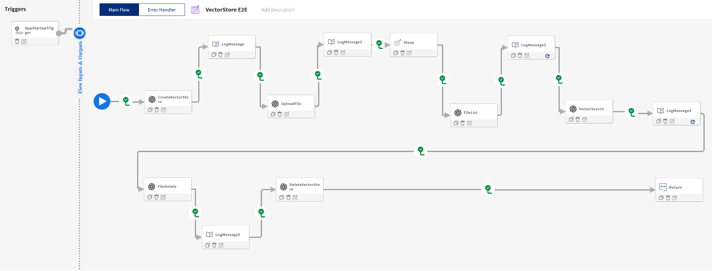

# OpenAI Vector E2E Sample — Setup & Run Guide

This guide walks you through setting up a VS Code environment with the latest Flogo extension and running the `openai-vector-e2e.flogo` sample.

---

## What this sample does

The `openai-vector-e2e.flogo` flow exercises the OpenAI Files and Vector Stores APIs end-to-end. On app startup the flow performs the following steps in order:



1. **StartActivity** — NoOp entry point that kicks off the flow.
2. **CreateVectorStore** — Creates a new vector store in OpenAI (named `VectorStoreTesting`).
3. **UploadFile** — Uploads a source file to the OpenAI file store and attaches it to the vector store.
4. **Sleep** — Waits for OpenAI to chunk and embed the uploaded file into the vector store.
5. **FileList** — Lists files in the vector store to confirm successful ingestion.
6. **VectorSearch** — Runs a search query against the vector store and returns relevant chunks.
7. **FileDelete** — Deletes the uploaded file from OpenAI's file store.
8. **DeleteVectorStore** — Deletes the vector store created in step 2.
9. **Return** — Ends the flow.

> Log activities between the steps above print intermediate state to the console and are intentionally omitted from this list.

Because the flow both creates and cleans up its resources within a single run, nothing remains in your OpenAI account after a successful execution.

---

## 1. Prerequisites

Before you start, make sure the following are installed and available on your `PATH`:

- **VS Code** (latest stable) — https://code.visualstudio.com/
- **Go** (version required by your Flogo distribution — typically 1.21+) — https://go.dev/dl/
- **Git** — https://git-scm.com/
- **TIBCO Flogo® Enterprise** entitlement / license (for the Flogo VS Code extension)
- An **OpenAI API key** with access to the Files, Vector Stores, and Embeddings APIs

Verify the basics from a terminal:

```bash
code --version
go version
git --version
```

---

## 2. Install the Flogo VS Code Extension

The Flogo VS Code extension is **not** available in the public VS Code Marketplace. You must download the `.vsix` package from the TIBCO download site and install it manually.

### 2.1 Download the extension

1. Sign in to the TIBCO download portal: https://edelivery.tibco.com/ (or your customer portal).
2. Locate **TIBCO Flogo® Enterprise** → **VS Code Extension**.
3. Download the latest `.vsix` file (e.g. `tibco-flogo-<version>.vsix`) to a local folder.

### 2.2 Install the `.vsix` in VS Code

Choose one of the following methods.

**Option A — VS Code UI:**
1. Open **VS Code**.
2. Open the **Extensions** view (`Ctrl+Shift+X` / `Cmd+Shift+X`).
3. Click the **`...`** (More Actions) menu in the top-right of the Extensions view.
4. Select **Install from VSIX...**.
5. Browse to the downloaded `.vsix` file and confirm.
6. Reload VS Code when prompted.

**Option B — Command line:**
```bash
code --install-extension /path/to/tibco-flogo-<version>.vsix
```

### 2.3 Verify the install

- Open the Command Palette (`Ctrl+Shift+P`) and run **`Flogo: Help`** — it should list available Flogo commands.
- The Flogo activity bar icon should appear in the left sidebar.

> Note: Because the extension is installed from a `.vsix`, VS Code will **not** auto-update it. To upgrade, download the newer `.vsix` from the TIBCO portal and repeat the steps above.

---

## 3. Clone the Repository

```bash
git clone https://github.com/<org>/flogo-enterprise-hub-rag-framework.git
cd flogo-enterprise-hub-rag-framework
code .
```

---

## 4. Open the Sample Flogo Project

1. In VS Code, open the file:
   `extensions/openAI/samples/e2e/openai-vector-e2e.flogo`
2. The Flogo extension will render the flow in the visual designer.
3. In the **Explorer** sidebar, a **Flogo App** section appears for the opened `.flogo` file.

---

## 5. Build & Run the Flogo Application

The Flogo VS Code extension builds and runs the app in a single action via **Configure and Run**.

### 5.1 Open the Configure dialog

1. In the **Explorer** sidebar, locate the **Flogo App** section that appears once the `.flogo` file is opened.
2. Click **`Configure and Run`**.
3. The **Configure** popup opens, allowing you to set environment variables for the app run.

### 5.2 Set required environment variables

Add the following environment variables in the popup. Multiple variables must be **separated by a comma**:

| Variable | Value | Purpose |
|----------|-------|---------|
| `FLOGO_APP_PROPS_ENV` | `auto` | Forces the Flogo app to resolve app properties from environment variables. **Required.** |
| `OPENAI_API_KEY` | `sk-...` (your OpenAI key) | Authenticates calls to the OpenAI API. **Required.** |

Example value entered in the popup's environment variables field:

```
FLOGO_APP_PROPS_ENV=auto,OPENAI_API_KEY=sk-your-key-here
```

> Add any additional app-specific properties (e.g. custom endpoint URLs, vector store IDs) as further comma-separated `NAME=VALUE` entries.

### 5.3 Save and Run

Click **`Save and Run`** in the Configure popup. The extension will:

1. Build the Flogo app for the current platform.
2. Launch the app with the provided environment variables.

You should see Flogo startup logs in the VS Code terminal indicating the triggers are listening (HTTP, timer, etc., depending on the flow).

---

## 6. Verify the Flow

This flow is **automatically triggered** — no manual request is required. As soon as the app starts it will run end-to-end.

- Watch the VS Code terminal logs to confirm:
  - File upload to OpenAI
  - Vector store creation / population
  - Vector store search results

> Note: This end-to-end sample also **cleans up** the resources it creates (files and vector stores) as part of the flow, so they will not appear in the OpenAI dashboard after the run completes.

---

## 7. Troubleshooting

| Issue | Resolution |
|-------|------------|
| `OPENAI_API_KEY` not set | Add it to the **Configure and Run** environment variables (comma-separated with `FLOGO_APP_PROPS_ENV=auto`). |
| App properties not picked up | Ensure `FLOGO_APP_PROPS_ENV=auto` is set in the Configure popup. |
| Flogo extension commands missing | Reload VS Code; ensure the extension is the latest version and activated. |
| Build fails on missing Go modules | Run `go mod tidy` in the project root. |
| 401 / 403 from OpenAI | Verify the API key has access to Files & Vector Stores APIs. |
| Vector store search returns no results | Confirm files were uploaded and indexed before searching (check `status` field). |

---

## 8. Clean Up

To avoid lingering OpenAI resources / billing, use the helper scripts under [`bin/`](../../../../bin/):

- `openai-filelist-openai` — list uploaded files
- `openai-filedelete-openai` — delete uploaded files
- `openai-vectorestore-list` — list vector stores
- `openai-vectorstore-delete-openai` — delete vector stores

---

For more information on the activities used in this sample, see [`../../readme.md`](../../readme.md).
