# AzureServiceBus Sample

## Description

This example demonstrates how to publish different types of messages to Azure Service Bus queues and topics, and how to receive and log messages using queue and topic subscribers.

The flow in the AzureServicebusSample app basically publish different types of messages over a queue and topic entities.The AzureServiceBus Queues are sent to and received messages from queues. The AzueServiceBus Topic subscribers will be used in publish-subscriber scenario. The example having multiple trigger handlers using AzureServcieBus trigger(Queue Receiver and Topic Subscriber) .

## Prerequisites

 1. Ensure that you have access of Azure portal.
 2. To Create and execute the AzureServiceBus app we require any one of the following  authentication type    
  a.Authentication type 'OAuth2' -  'ServiceBusNameSpace,TenantId,ClientId,ClientSecret'.
  b.Authentication type as'SAS Token'-'ServiceBusNameSpace,Authorization Rule Name, SharedAccessKey' from the Azure portal.

## Import sample into VSCode Workspace

1. Download the sample flogo file i.e 'AzureServicebusSample.flogo'
2. Place the downloaded file into your Visual Studio Code workspace.
3. Open the file by clicking on it in VSCode.

## Understanding the configuration

### The Connection

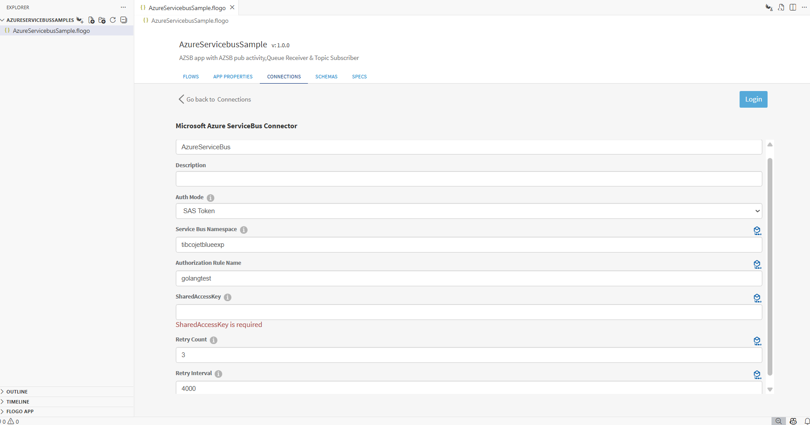

In the connection, note that:

1.Connection Name- In this field we give the connection name.  
2.Auth Mode- Select either 'SAS Token' or 'OAuth2'.  
3.Service Bus Namespace-In this field, we need to provide the Service Bus Namespace.   
4.Authorization Rule Name -In this field, we need to provide the Authorization Rule Name.  
5.SharedAccessKey-In this field, we need to provide the SharedAccessKey.  
6.Retry Count-The maximum number of times to retries to establish a connection.  
7.Retry Interval - The time interval in(ms) between each retry attempt.

### The Flow and InvokeRestService activity
If you open the app, you will see there are three flows, one is Publisher for Queues and Topics and other two is like consumer i.e QueueReceiver and TopicSubscriber
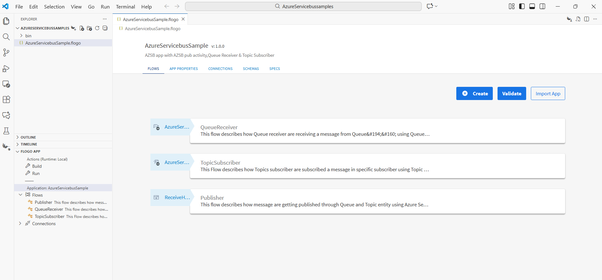

The 'Publisher' flow in the AzureServicebusSample app basically sends a messages over Queues and Topics. It has two publish activities for Queue and Topic respectively.All these operation will be done when execute the REST trigger with valid input schema provided in ReceiveHTTPMessage trigger. REST trigger have method POST.
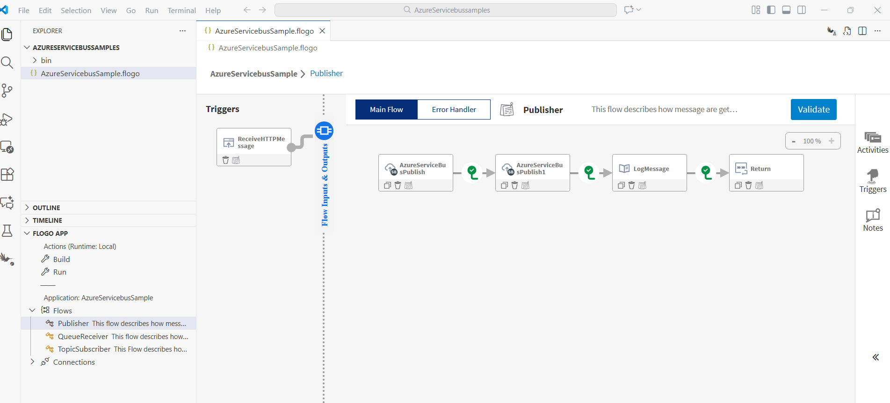

When 'Publisher' flow sends a message through a Queue, then the Queue Receiver trigger receives the message from the respective queue. To see how Will Queue Receivers work, see Azure Service Bus documentation.
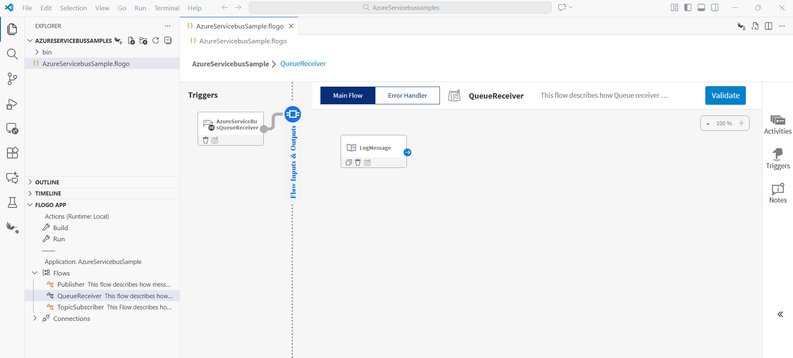

When 'Publisher' flow sends a message through a Topic, then the Topic Subscriber trigger receives the message from the topic of the respective subscriber. To see how Will Queue Receiver works, see Azure Service Bus documentation.
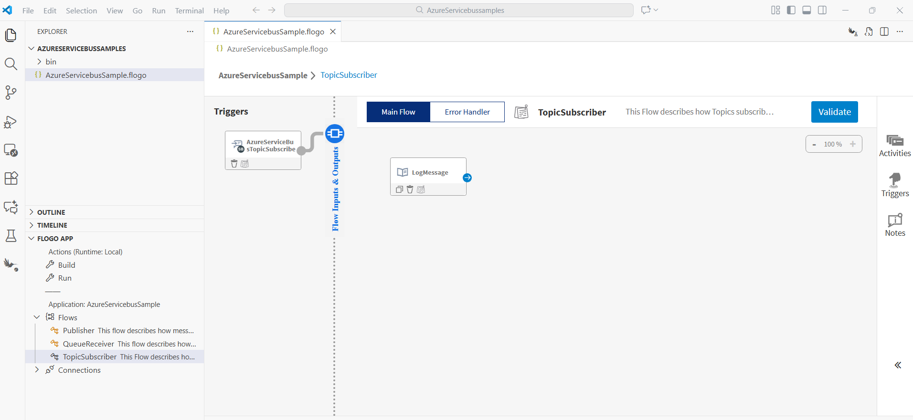

### Run the application
For running the application, 
1. Start by adding a local runtime in Visual Studio Code. Assign a name to the runtime and click the "Save" button.

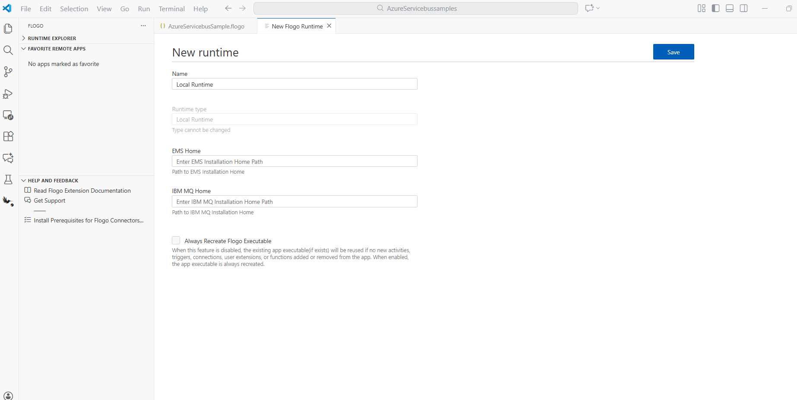

2. Select the local runtime you added for your Flogo Azureservicebus app. To do this, click on the FLOGO APP in the explorer, then click "Actions" and select the added Local Runtime.
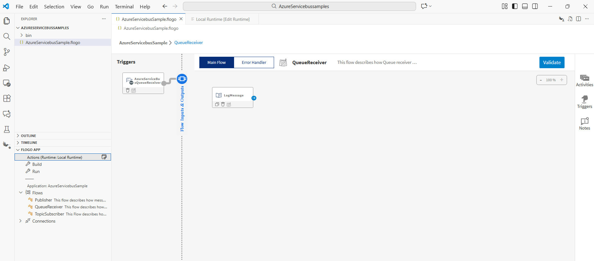

3. Now Build your Flogo Azureservicebus app. In the FLOGO APP section, click on "Build,".
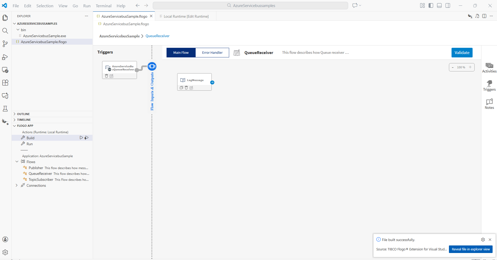

4. Once build is successful you can see the binary in bin folder.

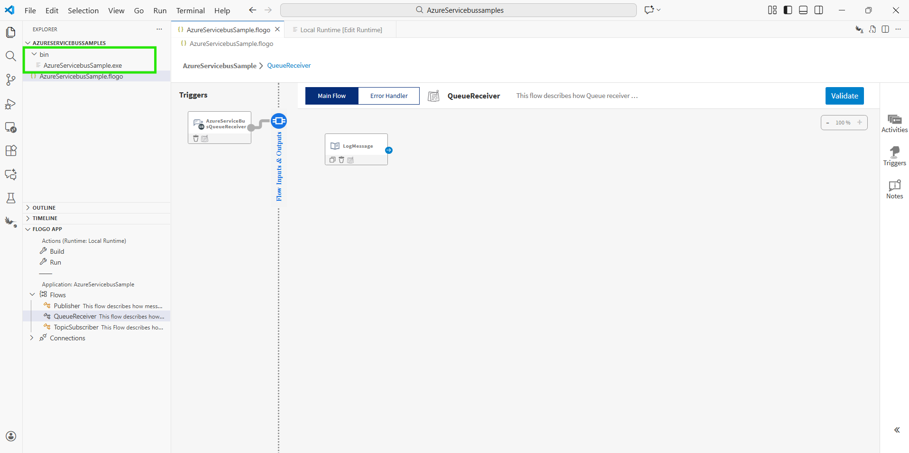

5. Now Run the Azureservicebus app. 
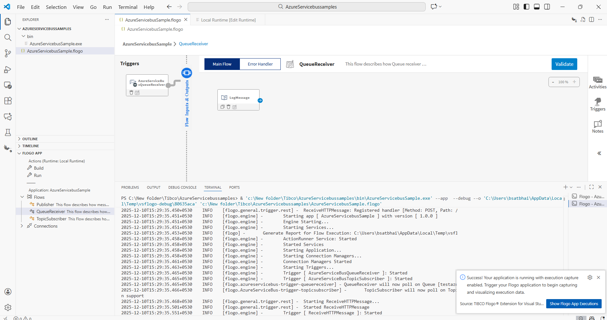.

6.Now Open Postman and select the method as 'POST',pass request body and url then click on 'Send' button.

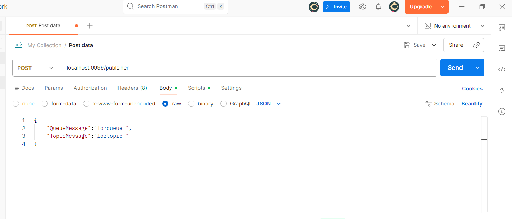.

7.After click on 'Send' button see the results.

## Outputs

1. Sample Response when click on 'Send' button

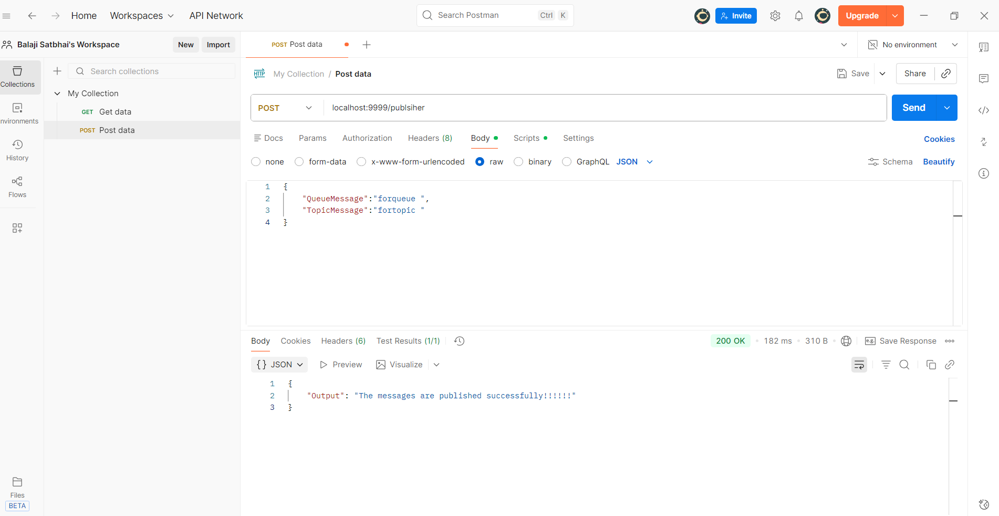

2. Sample Logs in VS Code
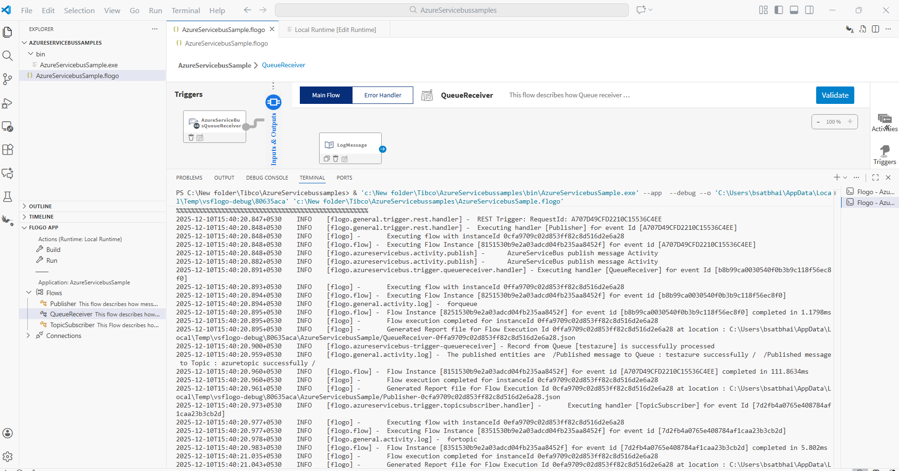

